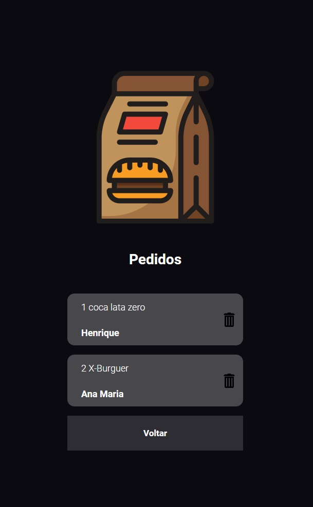

# Orders App Interface

This project is a simple usage of React.js and React Hooks. You can write your order and your name and send it to the app. It is going to redirect you to the orders page, where you can see all the orders, delete an order, or just come back to make another one

## Create an order

## Check all the orders

 

<h3>Feel free to get in touch with me to know more about the project:</h3>

  
 

